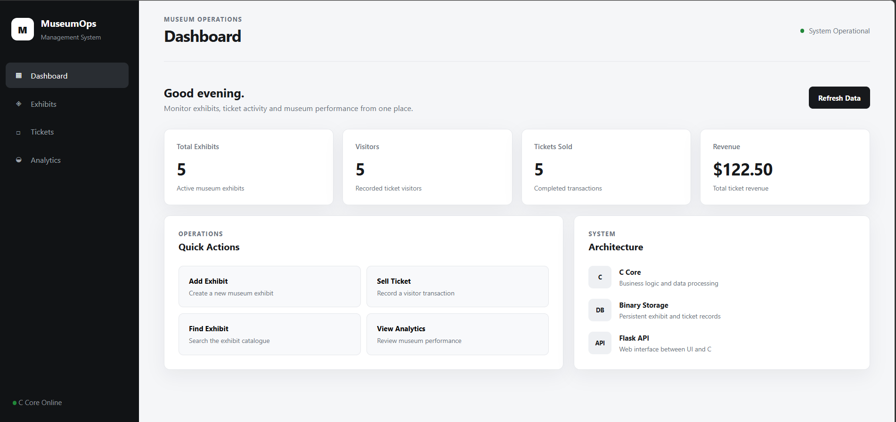
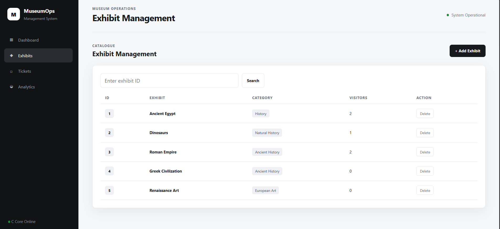
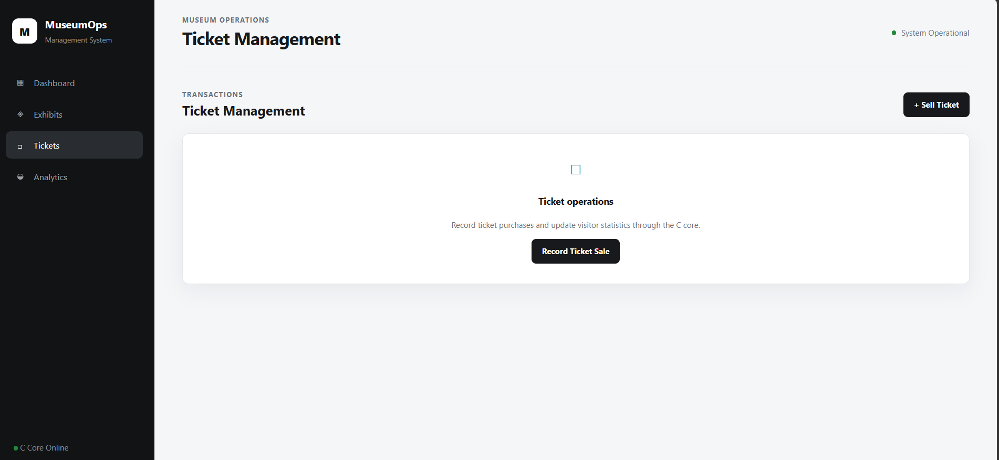

# Museum Exhibit & Ticket Management System

A full-stack museum management system built with a **C application core**, **Flask REST API**, and modern **HTML/CSS/JavaScript** web interface.

The system manages museum exhibits, visitor ticket transactions, persistent records, and operational analytics through a clean dashboard.

## Screenshots

### Dashboard



### Exhibit Management



### Ticket Management



## Features

- Exhibit management
  - Add new exhibits
  - Search exhibits by ID
  - Delete exhibits
  - View visitor counts
- Ticket management
  - Record ticket purchases
  - Store visitor information
  - Track ticket prices
- Dashboard
  - Total exhibits
  - Visitors
  - Tickets sold
  - Total revenue
- Analytics and museum performance overview
- Persistent binary data storage
- C-based business logic
- Flask API connecting the frontend with the C core
- Responsive web interface

## Architecture

```text
┌──────────────────────────────┐
│       Web Interface          │
│ HTML / CSS / JavaScript      │
└──────────────┬───────────────┘
               │
               │ HTTP / REST API
               ▼
┌──────────────────────────────┐
│          Flask API           │
│          Python              │
└──────────────┬───────────────┘
               │
               │ subprocess
               ▼
┌──────────────────────────────┐
│          C Core              │
│ Business Logic & Processing  │
└──────────────┬───────────────┘
               │
               ▼
┌──────────────────────────────┐
│      Binary Data Storage     │
│ exhibits.dat / tickets.dat   │
└──────────────────────────────┘